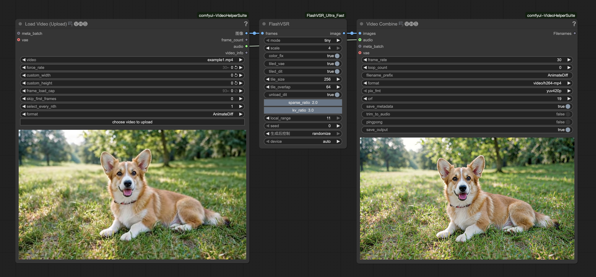

# ComfyUI-FlashVSR_Ultra_Fast
Running FlashVSR on lower VRAM without any artifacts.   
**[[中文版本](./README_zh.md)]**

## Preview


## Usage
- **mode:**  
`tiny` -> faster (default); `full` -> higher quality  
- **scale:**  
`4` is always better, unless you are low on VRAM then use `2`    
- **color_fix:**  
Use wavelet transform to correct the color of output video.  
- **tiled_vae:**  
Set to True for lower VRAM consumption during decoding at the cost of speed.  
- **tiled_dit:**  
Significantly reduces VRAM usage at the cost of speed.
- **tile\_size, tile\_overlap**:  
How to split the input video.  
- **unload_dit:**  
Unload DiT before decoding to reduce VRAM peak at the cost of speed.  

## Installation

#### nodes:
⚠️ The precompiled `Block-Sparse-Attention` whl is for torch2.7+cu128 and doesn't support torch2.8!  
⚠️ If you are using PyTorch 2.8 or later, please install `Block-Sparse-Attention` from the source code.  
⚠️ Refer to the "Compiling Block-Sparse-Attention" section in the appendix below.  

```bash
#If you are using torch2.7+cu128, run the following command to install the nodes:

cd ComfyUI/custom_nodes
git clone https://github.com/lihaoyun6/ComfyUI-FlashVSR_Ultra_Fast.git
python -m pip install -r ComfyUI-FlashVSR_Ultra_Fast/requirements.txt
```

#### models:

- Download the entire `FlashVSR` folder with all the files inside it from [here](https://huggingface.co/JunhaoZhuang/FlashVSR) and put it in the `ComfyUI/models`

```
├── ComfyUI/models/FlashVSR
|     ├── LQ_proj_in.ckpt
|     ├── TCDecoder.ckpt
|     ├── diffusion_pytorch_model_streaming_dmd.safetensors
|     ├── Wan2.1_VAE.pth
```

## Acknowledgments
- [FlashVSR](https://github.com/OpenImagingLab/FlashVSR) @OpenImagingLab  
- [Block-Sparse-Attention](https://github.com/mit-han-lab/Block-Sparse-Attention) @mit-han-lab
- [ComfyUI](https://github.com/comfyanonymous/ComfyUI) @comfyanonymous

## Appendix
### Compiling Block-Sparse-Attention:

1. First, make sure you have the `MSVC` build environment and `CUDAToolkit` installed.  
2. Run the following commands to compile and install:

```bash
git clone https://github.com/lihaoyun6/Block-Sparse-Attention
cd Block-Sparse-Attention
pip install packaging
pip install ninja
set MAX_JOBS=4   # For Linux users, run: export MAX_JOBS=4
python setup.py install
```
